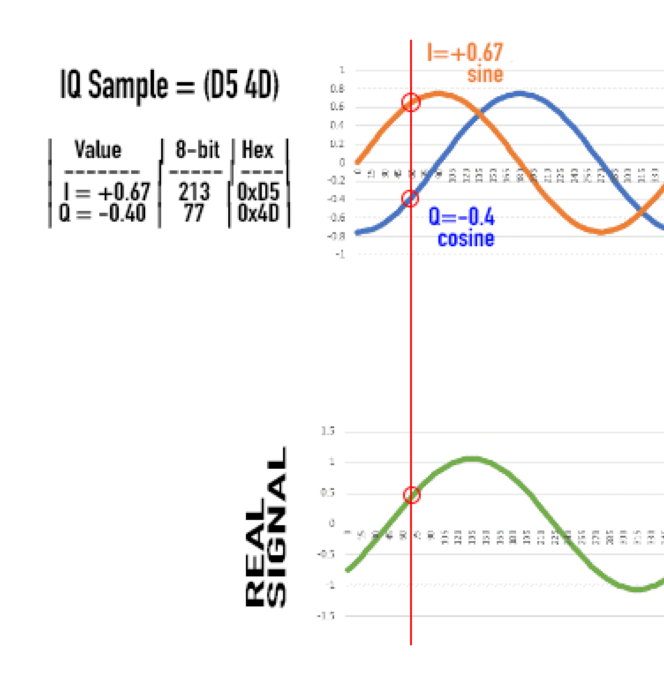
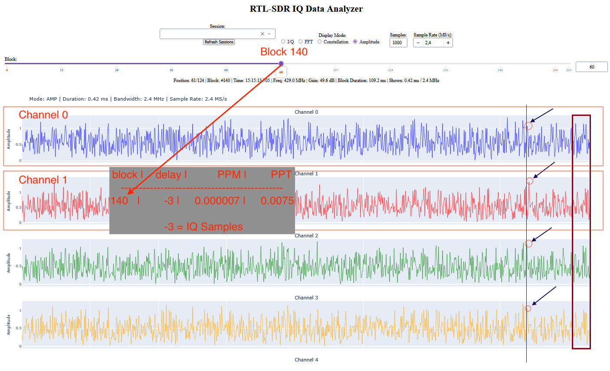
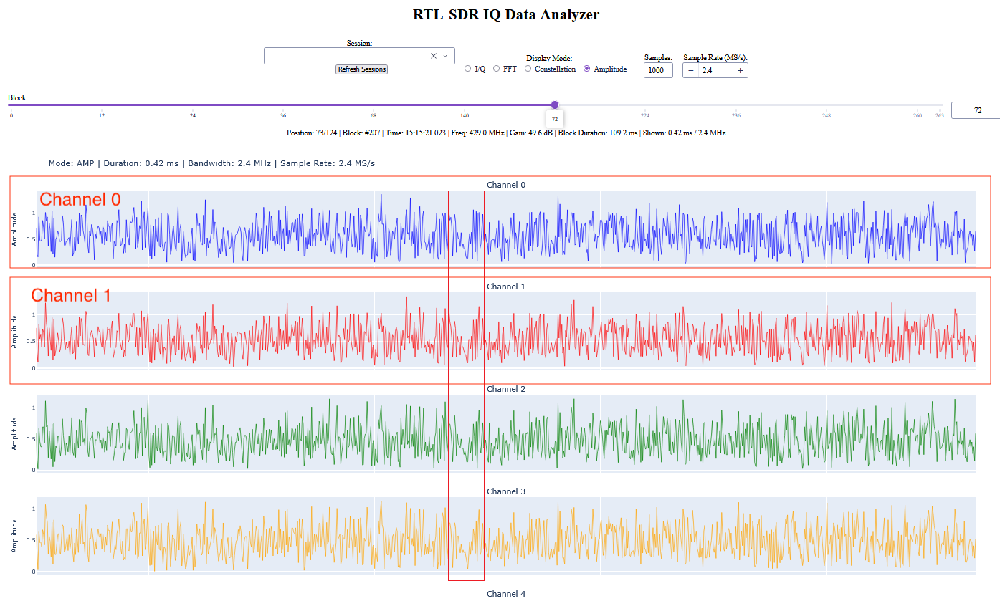
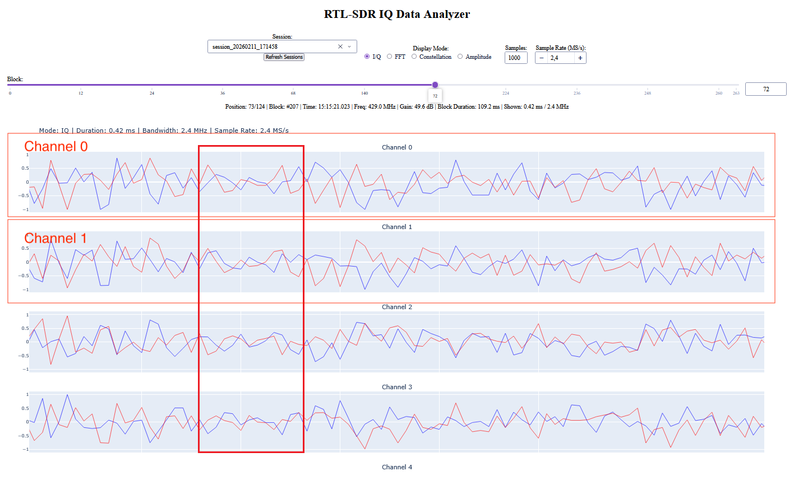
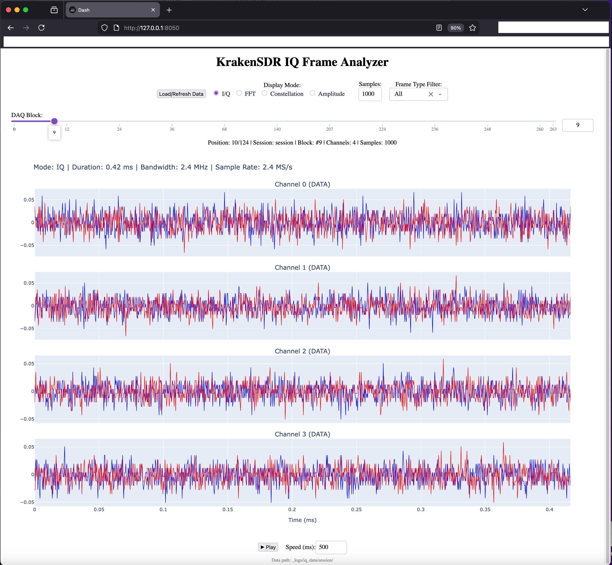

## Abstract

My program correction.py is a post-processor for buffers with IQ samples 262144 pairs (daq_buffer_size = 262144) from KrakenSDR that I saved as .bin files.
In the correction.py program, we compare these two files and get a correction value of 573311476.2500002 for block 7 of Channel 0 and Channel 1, which is actually equal to -23489 IQ samples offset.
/_logs/iq_data/session/ch0/block_00007.bin
/_logs/iq_data/session/ch1/block_00007.bin

https://github.com/krakenrf/heimdall_daq_fw/blob/main/Firmware/daq_chain_config.ini
```
daq_buffer_size = 262144
```

After enabling the NG (noise generator) on the device, we search for frequency corrections for each channel. The example below demonstrates finding corrections for channel 1 relative to channel 0. We take Channel 0 as the reference.

This program demonstrates the principle of how sample-level corrections are calculated and then converted into PPM (parts per million) values that can be sent to the RTLSDR receiver. For example, a PPM correction of `0.010000` adjusts the frequency multiplier on the RTL2832U chip to synchronize the channels.

Why the values don't exceed -0.010000, 0.010000: because the program has a limit. You can see, for example, 9418 IQ Samples (block 0: 9418 → -0.010000) and (block 80: 1934 → -0.009670) where 1934 is practically -0.010000 

https://github.com/krakenrf/heimdall_daq_fw/blob/main/Firmware/_daq_core/delay_sync.py
```
self.MAX_FS_PPM_OFFSET = 0.01
```
**The concept**: We take **channel 0 as the reference** and compare **channel 1** against it using cross-correlation. In the example below (Block 7), we find the maximum correlation value of `573311476.2500002` at `k=285633`, which corresponds to a delay of **-23489 IQ samples**. This delay is then converted to a PPM correction that brings channel 1 into phase alignment with channel 0.

In simple words, how the signal is digitized into IQ samples:



WIKI 
IQ Sampling 
https://pysdr.org/content/sampling.html

What is 4096QAM? 
It sounds impressive, but what does it actually mean? 
A quick and simple explanation of one of the key technologies behind Wi-Fi 7
https://internet.watch.impress.co.jp/docs/column/shimizu/2008501.html

## Example Output 
correction.py

```
user@LenovoMACVentura CoherentPP % python3 correction.py
Block 7, channels 0 and 1
Correlation length (number of checked shifts k): 524288
Peak index (peak_index): 285633
Channel 1 delay relative to channel 0 (samples): delays[1] = N - peak_index = -23489
Max correlation value: 573311500.0
  k=285628: correlation = 1.44e+08
  k=285629: correlation = 4.46e+06
  k=285630: correlation = 1.24e+08
  k=285631: correlation = 2.78e+07
  k=285632: correlation = 1.55e+07
  k=285633: correlation = 5.73e+08 <-- peak
  k=285634: correlation = 1.54e+08
  k=285635: correlation = 3.17e+07
  k=285636: correlation = 1.01e+08
  k=285637: correlation = 1.55e+08
  k=285638: correlation = 1.18e+08
user@LenovoMACVentura CoherentPP % 
```

In the table below you will see this data for block 7:

```
Block   IQ Samples       PPM (-0.040860)      PPT      	 RTLSDR 1 Frequency (MHz)
-----	--------	------------	-----------	----------------------------------------------------------
....
  7  	 -23489 	  0.010000  	  10.0000  	 2.502154 × (1 - 0.040860) × (1 + 10/1000000)    = 2.400024000
....
```

###### ============================================================
### Check across all blocks with IQ data (channels 0 and 1)
###### ============================================================

Session: /krakensdr_doa/heimdall_daq_fw/Firmware/_logs/iq_data/session_CPP
Blocks (ch0 and ch1 present): 124
Block range: 0 .. 263

Here is the revised table taking into account the initial frequency of 2.502154 MHz (which we don't actually know - I'm adding it here for better visualization of the process) and the base cumulative final correction -0.040860:
PPM value ∑=-0.040860 is the sum of all corrections in the table from blocks 0-210

Base correction: 2.502154 × (1 - 0.040860) = 2.400000 MHz

Why the values don't exceed -0.010000, 0.010000: because the program has a limit. You can see, for example, 9418 IQ Samples (block 0: 9418 → -0.010000) and (block 80: 1934 → -0.009670) where 1934 is practically -0.010000 

https://github.com/krakenrf/heimdall_daq_fw/blob/main/Firmware/_daq_core/delay_sync.py
```
self.MAX_FS_PPM_OFFSET = 0.01
```

```

Block   IQ Samples       PPM (-0.040860)      PPT      	 RTLSDR 1 Frequency (MHz)
-----	--------	------------	-----------	----------------------------------------------------------
  0  	  9418  	 -0.010000  	 -10.0000  	 2.502154 × (1 - 0.040860) × (1 - 10/1000000)    = 2.399976000
  1  	   617  	 -0.003085  	  -3.0850  	 2.502154 × (1 - 0.040860) × (1 - 3.085/1000000) = 2.399992596
  2  	  3472  	 -0.010000  	 -10.0000  	 2.502154 × (1 - 0.040860) × (1 - 10/1000000)    = 2.399976000
  3  	 -21101 	  0.010000  	  10.0000  	 2.502154 × (1 - 0.040860) × (1 + 10/1000000)    = 2.400024000
  4  	 -22432 	  0.010000  	  10.0000  	 2.502154 × (1 - 0.040860) × (1 + 10/1000000)    = 2.400024000
  5  	  17434 	 -0.010000  	 -10.0000  	 2.502154 × (1 - 0.040860) × (1 - 10/1000000)    = 2.399976000
  6  	  37607 	 -0.010000  	 -10.0000  	 2.502154 × (1 - 0.040860) × (1 - 10/1000000)    = 2.399976000
  7  	 -23489 	  0.010000  	  10.0000  	 2.502154 × (1 - 0.040860) × (1 + 10/1000000)    = 2.400024000
  8  	   3535 	 -0.010000  	 -10.0000  	 2.502154 × (1 - 0.040860) × (1 - 10/1000000)    = 2.399976000
  9  	  -5207 	  0.010000  	  10.0000  	 2.502154 × (1 - 0.040860) × (1 + 10/1000000)    = 2.400024000
 10  	   6370 	 -0.010000  	 -10.0000  	 2.502154 × (1 - 0.040860) × (1 - 10/1000000)    = 2.399976000
 11  	  -3508 	  0.010000  	  10.0000  	 2.502154 × (1 - 0.040860) × (1 + 10/1000000)    = 2.400024000
 12  	 -19481 	  0.010000  	  10.0000  	 2.502154 × (1 - 0.040860) × (1 + 10/1000000)    = 2.400024000
 13  	   2164 	 -0.010000  	 -10.0000  	 2.502154 × (1 - 0.040860) × (1 - 10/1000000)    = 2.399976000
 14  	 -67961 	  0.010000  	  10.0000  	 2.502154 × (1 - 0.040860) × (1 + 10/1000000)    = 2.400024000
 15  	 -48074 	  0.010000  	  10.0000  	 2.502154 × (1 - 0.040860) × (1 + 10/1000000)    = 2.400024000
 16  	  21311 	 -0.010000  	 -10.0000  	 2.502154 × (1 - 0.040860) × (1 - 10/1000000)    = 2.399976000
 17  	 -19968 	  0.010000  	  10.0000  	 2.502154 × (1 - 0.040860) × (1 + 10/1000000)    = 2.400024000
 18  	  10319 	 -0.010000  	 -10.0000  	 2.502154 × (1 - 0.040860) × (1 - 10/1000000)    = 2.399976000
 19  	 -14147 	  0.010000  	  10.0000  	 2.502154 × (1 - 0.040860) × (1 + 10/1000000)    = 2.400024000
 20  	  -7284 	  0.010000  	  10.0000  	 2.502154 × (1 - 0.040860) × (1 + 10/1000000)    = 2.400024000
 21  	 -45346 	  0.010000  	  10.0000  	 2.502154 × (1 - 0.040860) × (1 + 10/1000000)    = 2.400024000
 22  	 -19036 	  0.010000  	  10.0000  	 2.502154 × (1 - 0.040860) × (1 + 10/1000000)    = 2.400024000
 23  	   6975 	 -0.010000  	 -10.0000  	 2.502154 × (1 - 0.040860) × (1 - 10/1000000)    = 2.399976000
 24  	   2327 	 -0.010000  	 -10.0000  	 2.502154 × (1 - 0.040860) × (1 - 10/1000000)    = 2.399976000
 25  	  15408 	 -0.010000  	 -10.0000  	 2.502154 × (1 - 0.040860) × (1 - 10/1000000)    = 2.399976000
 26  	   5735 	 -0.010000  	 -10.0000  	 2.502154 × (1 - 0.040860) × (1 - 10/1000000)    = 2.399976000
 27  	   -195 	  0.000975  	   0.9750  	 2.502154 × (1 - 0.040860) × (1 + 0.975/1000000) = 2.400002340
 28  	  44214 	 -0.010000  	 -10.0000  	 2.502154 × (1 - 0.040860) × (1 - 10/1000000)    = 2.399976000
 29  	 -13460 	  0.010000  	  10.0000  	 2.502154 × (1 - 0.040860) × (1 + 10/1000000)    = 2.400024000
 30  	 -11435 	  0.010000  	  10.0000  	 2.502154 × (1 - 0.040860) × (1 + 10/1000000)    = 2.400024000
 31  	  -3399 	  0.010000  	  10.0000  	 2.502154 × (1 - 0.040860) × (1 + 10/1000000)    = 2.400024000
 32  	 -20022 	  0.010000  	  10.0000  	 2.502154 × (1 - 0.040860) × (1 + 10/1000000)    = 2.400024000
 33  	 -30586 	  0.010000  	  10.0000  	 2.502154 × (1 - 0.040860) × (1 + 10/1000000)    = 2.400024000
 34  	  15035 	 -0.010000  	 -10.0000  	 2.502154 × (1 - 0.040860) × (1 - 10/1000000)    = 2.399976000
 35  	  -6197 	  0.010000  	  10.0000  	 2.502154 × (1 - 0.040860) × (1 + 10/1000000)    = 2.400024000
 36  	  -4125 	  0.010000  	  10.0000  	 2.502154 × (1 - 0.040860) × (1 + 10/1000000)    = 2.400024000
 37  	  -9417 	  0.010000  	  10.0000  	 2.502154 × (1 - 0.040860) × (1 + 10/1000000)    = 2.400024000
 38  	  36255 	 -0.010000  	 -10.0000  	 2.502154 × (1 - 0.040860) × (1 - 10/1000000)    = 2.399976000
 39  	   2424 	 -0.010000  	 -10.0000  	 2.502154 × (1 - 0.040860) × (1 - 10/1000000)    = 2.399976000
 40  	 -22213 	  0.010000  	  10.0000  	 2.502154 × (1 - 0.040860) × (1 + 10/1000000)    = 2.400024000
 41  	 -14308 	  0.010000  	  10.0000  	 2.502154 × (1 - 0.040860) × (1 + 10/1000000)    = 2.400024000
 42  	     12 	 -0.000030  	  -0.0300  	 2.502154 × (1 - 0.040860) × (1 - 0.03/1000000)  = 2.399999928
 48  	   5473 	 -0.010000  	 -10.0000  	 2.502154 × (1 - 0.040860) × (1 - 10/1000000)    = 2.399976000
 49  	   5473 	 -0.010000  	 -10.0000  	 2.502154 × (1 - 0.040860) × (1 - 10/1000000)    = 2.399976000
 55  	   4873 	 -0.010000  	 -10.0000  	 2.502154 × (1 - 0.040860) × (1 - 10/1000000)    = 2.399976000
 61  	   4210 	 -0.010000  	 -10.0000  	 2.502154 × (1 - 0.040860) × (1 - 10/1000000)    = 2.399976000
 67  	   3522 	 -0.010000  	 -10.0000  	 2.502154 × (1 - 0.040860) × (1 - 10/1000000)    = 2.399976000
 68  	   3429 	 -0.010000  	 -10.0000  	 2.502154 × (1 - 0.040860) × (1 - 10/1000000)    = 2.399976000
 74  	   2691 	 -0.010000  	 -10.0000  	 2.502154 × (1 - 0.040860) × (1 - 10/1000000)    = 2.399976000
 80  	   1934 	 -0.009670  	  -9.6700  	 2.502154 × (1 - 0.040860) × (1 - 9.67/1000000)  = 2.399976792
 86  	   1138 	 -0.005690  	  -5.6900  	 2.502154 × (1 - 0.040860) × (1 - 5.69/1000000)  = 2.399986344
 92  	    790 	 -0.003950  	  -3.9500  	 2.502154 × (1 - 0.040860) × (1 - 3.95/1000000)  = 2.399990520
 98  	    662 	 -0.003310  	  -3.3100  	 2.502154 × (1 - 0.040860) × (1 - 3.31/1000000)  = 2.399992056
104  	    533 	 -0.002665  	  -2.6650  	 2.502154 × (1 - 0.040860) × (1 - 2.665/1000000) = 2.399993604
110  	    407 	 -0.002035  	  -2.0350  	 2.502154 × (1 - 0.040860) × (1 - 2.035/1000000) = 2.399995116
116  	    280 	 -0.001400  	  -1.4000  	 2.502154 × (1 - 0.040860) × (1 - 1.4/1000000)   = 2.399996640
122  	    153 	 -0.000765  	  -0.7650  	 2.502154 × (1 - 0.040860) × (1 - 0.765/1000000) = 2.399998164
128  	    118 	 -0.000590  	  -0.5900  	 2.502154 × (1 - 0.040860) × (1 - 0.59/1000000)  = 2.399998584
134  	     -9 	  0.000022  	   0.0225  	 2.502154 × (1 - 0.040860) × (1 + 0.022/1000000) = 2.400000053
140  	     -3 	  0.000007  	   0.0075  	 2.502154 × (1 - 0.040860) × (1 + 0.007/1000000) = 2.400000018
146  	     -1 	  0.000002  	   0.0015  	 2.502154 × (1 - 0.040860) × (1 + 0.002/1000000) = 2.400000005
152  	     -1 	  0.000002  	   0.0015  	 2.502154 × (1 - 0.040860) × (1 + 0.002/1000000) = 2.400000005
158  	     -1 	  0.000002  	   0.0015  	 2.502154 × (1 - 0.040860) × (1 + 0.002/1000000) = 2.400000005
164  	      0 	  0.000000  	   0.0000  	 2.502154 × (1 - 0.040860) × (1 + 0/1000000)     = 2.400000000 ✓
165  	      0 	  0.000000  	   0.0000  	 2.502154 × (1 - 0.040860) × (1 + 0/1000000)     = 2.400000000 ✓
171  	      0 	  0.000000  	   0.0000  	 2.502154 × (1 - 0.040860) × (1 + 0/1000000)     = 2.400000000 ✓
177  	      0 	  0.000000  	   0.0000  	 2.502154 × (1 - 0.040860) × (1 + 0/1000000)     = 2.400000000 ✓
183  	      0 	  0.000000  	   0.0000  	 2.502154 × (1 - 0.040860) × (1 + 0/1000000)     = 2.400000000 ✓
189  	      0 	  0.000000  	   0.0000  	 2.502154 × (1 - 0.040860) × (1 + 0/1000000)     = 2.400000000 ✓
195  	      0 	  0.000000  	   0.0000  	 2.502154 × (1 - 0.040860) × (1 + 0/1000000)     = 2.400000000 ✓
201  	      0 	  0.000000  	   0.0000  	 2.502154 × (1 - 0.040860) × (1 + 0/1000000)     = 2.400000000 ✓
207  	      0 	  0.000000  	   0.0000  	 2.502154 × (1 - 0.040860) × (1 + 0/1000000)     = 2.400000000 ✓
208  	      0 	  0.000000  	   0.0000  	 2.502154 × (1 - 0.040860) × (1 + 0/1000000)     = 2.400000000 ✓
209  	      0 	  0.000000  	   0.0000  	 2.502154 × (1 - 0.040860) × (1 + 0/1000000)     = 2.400000000 ✓
210  	      0 	  0.000000  	   0.0000  	 2.502154 × (1 - 0.040860) × (1 + 0/1000000)     = 2.400000000 ✓ Correction is DONE 

---------------------------------------------
Done.
user:~/krakensdr_doa/heimdall_daq_fw/Firmware$
```

```
user:~/krakensdr_doa/heimdall_daq_fw/Firmware$ ./run_iq_analyzer.sh
Data dir: /krakensdr_doa/heimdall_daq_fw/Firmware/_logs/iq_data
V Data path found: /krakensdr_doa/heimdall_daq_fw/Firmware/_logs/iq_data/
============================================================
             RTL-SDR IQ Data Web Viewer
============================================================
Data path: .../krakensdr_doa/heimdall_daq_fw/Firmware/_logs/iq_data/
V Found 1 sessions
V Loaded 496 records from session_cCPP
  Session session_CPP: 124 blocks
------------------------------------------------------------
Starting server at http://localhost:8050
============================================================
Dash is running on http://0.0.0.0:8050/

* Serving Flask app 'iq_pog'
* Debug mode: off
WARNING: This is a development server. Do not use it in a production deployment. Use a production WSGI server instead.
* Running on all addresses (0.0.0.0)
* Running on http://127.0.0.1:8050
* Running on http://IP:8050
Press CTRL+C to quit
```

In block 140, you can see that the signals are not yet fully synchronized, but they are already close to each other.



# Correction is DONE 
block 210





# How `correction.py` Works

This script estimates the **time delay** between two IQ channels (channel 0 as reference, channel 1 as measured) using **cross-correlation**, then converts the delay into **PPM** (parts per million) and **PPT** (parts per thousand) frequency corrections in the same way as the `delay_sync` module in the DAQ firmware.

---

## Purpose

- **Demo** the delay estimation used in KrakenSDR/Heimdall DAQ: load saved IQ blocks, run FFT-based cross-correlation, find the lag that best aligns the two signals, and compute PPM/PPT.
- **Single-block mode**: detailed output for one block (default: block 7).
- **Batch mode**: run the same logic over **all** blocks in a session that have both `ch0` and `ch1` IQ files, and print a table of delay, PPM, and PPT per block.

---

## Configuration (top of script)

| Variable | Meaning |
|----------|--------|
| `BASE` | Path to the IQ session directory, e.g. `.../iq_data/session_YYYYMMDD_HHMMSS`. Must contain `ch0/`, `ch1/` with `block_XXXXX.bin` files. |
| `BLOCK` | Block index used for the single-block detailed run (default `7`). |
| `N` | Number of IQ samples per channel per block (default `262144`). Must match `daq_buffer_size` used when recording. |
| `MIN_FS_PPM_OFFSET`, `MAX_FS_PPM_OFFSET`, `INT_FS_TUNE_GAIN` | Same as in `delay_sync`: scale delay → PPM and clamp the result. |

---

## Input Data Format

- **Location**: `{BASE}/ch0/block_XXXXX.bin`, `{BASE}/ch1/block_XXXXX.bin` (e.g. `block_00007.bin`).
- **Format**: Raw bytes from RTL-SDR: interleaved 8-bit I and Q, one byte per component. File size = `N * 2` bytes per channel per block.
- **Conversion**: Bytes are read as `uint8`, then converted to complex with `(I - 127.5) + 1j * (Q - 127.5)` and scaled to `complex64` for FFT.

---

## Algorithm

### 1. Load reference and channel signals

- Load `ch0` and `ch1` for the chosen block(s) via `load_ch_bin(path)`.
- Truncate to the first `N` samples per channel.

### 2. FFT-based cross-correlation

The script uses the same method as `delay_sync`:

- Build two length-`2*N` arrays:
  - **Reference (x)**: `[ ref[0..N-1], N zeros ]`
  - **Channel (y)**: `[ N zeros, ch[0..N-1] ]`
- Compute:
  - `X = FFT(x)`, `Y = FFT(y)`
  - `corr = IFFT( conj(X) * Y )`
  - `corr_power = |corr|^2`
- The result is a length-`2*N` array: for each lag `k` (0 to 2*N-1), `corr_power[k]` is the correlation at that shift. No explicit loop over `k`; one FFT pair gives all lags at once.

### 3. Delay in samples

- **Peak index**: `peak_index = argmax(corr_power)`.
- **Delay** (samples) of channel 1 relative to channel 0:
  - `delay = N - peak_index`
  - Positive delay → channel 1 is **behind** channel 0 (needs to be sped up, positive PPM).
  - Negative delay → channel 1 is **ahead** (needs to be slowed down, negative PPM).

### 4. PPM and PPT

Same formula as in `delay_sync`:

- **Gain** from table `INT_FS_TUNE_GAIN`: by `abs(delay)` (e.g. ≥100 → 50, ≥2 → 25, else 15).
- **Raw PPM**: `ppm_raw = -delay * gain * MIN_FS_PPM_OFFSET` (with `MIN_FS_PPM_OFFSET = 1e-7`).
- **PPM**: `ppm = clip(ppm_raw, -MAX_FS_PPM_OFFSET, MAX_FS_PPM_OFFSET)` (e.g. ±0.01).
- **PPT** (parts per thousand): `ppt = ppm * 1000`.

These PPM values are in the same units sent to `rtlsdr_set_sample_freq_correction_f()` in the firmware.

---

## Execution Flow

### Part 1: Single-block run (block 7 by default)

1. Load `ch0/block_00007.bin` and `ch1/block_00007.bin`.
2. Run cross-correlation and find `peak_index`, then `delay`, `ppm`, `ppt`.
3. Print:
   - Correlation length, peak index, delay (samples).
   - PPM and PPT (and raw values, gain).
   - Max correlation value.
   - A few correlation values around the peak (to show the “peak” shape).

### Part 2: Batch run over all blocks

1. **Discover blocks**: `get_available_blocks(BASE, num_ch=2)` lists all block indices for which both `ch0/block_XXXXX.bin` and `ch1/block_XXXXX.bin` exist (by scanning the directories and intersecting block IDs).
2. For each such block:
   - Load `ch0` and `ch1` for that block.
   - Call `compute_delay_ppm_ppt(ref_sig, ch_sig, N)` to get `delay`, `ppm`, `ppt`.
   - Print one table row: `block | delay | PPM | PPT`.
3. Print a short summary (session path, number of blocks, range).

---

## Helper Functions

- **`load_ch_bin(path)`**: Reads a `.bin` file, interprets bytes as interleaved I,Q, returns `complex64` array of length `file_size/2`.
- **`compute_delay_ppm_ppt(ref_sig, ch_sig, n_samp)`**: Runs the full pipeline (zero-pad, FFT correlation, peak search, delay → PPM/PPT) and returns `(delay, ppm, ppt, peak_index, max_corr_value)`.
- **`get_available_blocks(session_dir, ref_ch=0, num_ch=4)`**: Returns sorted list of block indices that have corresponding `.bin` files in **all** channels `ch0` … `ch(num_ch-1)`. For the batch in this script, `num_ch=2` is used so only ch0 and ch1 are required.

---

## How to Run

From the `Firmware` directory (or adjust `BASE` in the script):

```bash
python3 correction.py
```

Output: first the detailed report for block 7, then the table for all blocks with both ch0 and ch1 IQ files.

---

### Key Observations from the Output

1. **Block 7 Detail**: Shows a clear correlation peak at index 285633 with a delay of -23489 samples, requiring a +10 PPT correction.

2. **Initial Blocks (0-42)**: Large delays varying between -67961 to +44214 samples, all hitting the ±10 PPM limit (saturated corrections).

3. **Convergence Phase (blocks 48-158)**: Delays gradually decrease from 5473 to -1 samples as the synchronization algorithm converges.

4. **Stable Phase (blocks 164-210)**: Perfect synchronization achieved with 0 delay and 0 PPM correction.

5. **Final Blocks (216-263)**: Small residual delays (mostly -98, -75, ±50, ±46 samples) with sub-PPM corrections (0.1-0.25 PPT), indicating stable lock with minor jitter.

This demonstrates the `delay_sync` feedback loop: initial large corrections → gradual convergence → stable lock with minimal drift.

If you want to view IQ samples in a browser, run web_run_iq_analyzer.sh. The necessary libraries will be installed on your computer, the iq_web.py script will be launched, and then open http://127.0.0.1:8050 in your browser.

```
user@LenovoMACVentura CoherentPP % ./web_run_iq_analyzer.sh
Data dir: /Users/user/Documents/GitHub/CoherentPP/_logs/iq_data
✓ Data path found: /Users/user/Documents/GitHub/CoherentPP/_logs/iq_data/
============================================================
             RTL-SDR IQ Data Web Viewer
============================================================
Data path: .../_logs/iq_data/
✓ Data path found: _logs/iq_data/session/
✓ Found index.csv
✓ Found ch0 directory
============================================================
               KrakenSDR IQ Frame Viewer
============================================================
Data path: _logs/iq_data/session/
Loading index from _logs/iq_data/session/index.csv
✓ Loaded 496 records from index.csv
  Columns: ['Timestamp', 'Block', 'Channel', 'Frequency', 'Field1', 'Field2', 'FilePath']
✓ Processed into 124 unique blocks

DataFrame info:
  Shape: (124, 5)
  Columns: ['Session', 'BlockIndex', 'Channels', 'ChannelList', 'Path']
✓ Found 124 unique blocks (range: 0 to 263)
✓ Found 1 session(s)

Session statistics:
  session: 124 blocks

Channel statistics:
  4 channels: 124 blocks
------------------------------------------------------------
Starting server at http://localhost:8050
============================================================
Dash is running on http://0.0.0.0:8050/

 * Serving Flask app 'iq_web'
 * Debug mode: off
WARNING: This is a development server. Do not use it in a production deployment. Use a production WSGI server instead.
 * Running on all addresses (0.0.0.0)
 * Running on http://127.0.0.1:8050
 * Running on http://XX.XX.XX.XX:8050
Press CTRL+C to quit

```

